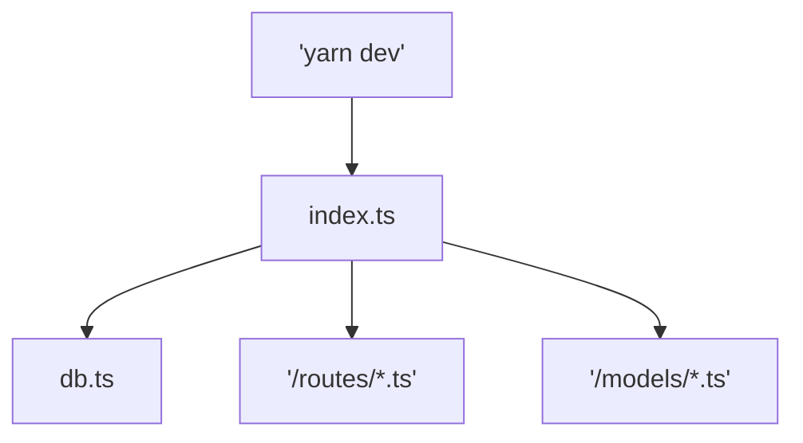

# server

## layout

the root application is in `src`, inside there's the root level files and folders.

### `/models`

this is where our mongoose data model definitions lie. these are the shapes of the database entries, helpers to create and access them, and tools to use them in other places.

### `/routes`

this is where our route handlers go. these handlers will take a `req` or request and send back a response via the `res` object. the most basic example:

```ts
import {Router, Request, Response} from 'express';

// create a router to pass to your express app
export const router_demo = Router();

// create a handler to send back 'hello' to the request object provided by express
const say_hello = (req: Request, res: Response) => {
  res.send('hello');
}

// set the url /api/hello to call the say_hello handler
router_demo.get('/api/hello', say_hello);
```

this router can be used in the root of any of your applications.

### root level

this stuff is generally the `index.ts` file and associated things that are distinct but related to it. here we have a db setup and teardown that is in `db.ts` so we can use it for testing (soon!).

## start up flow


